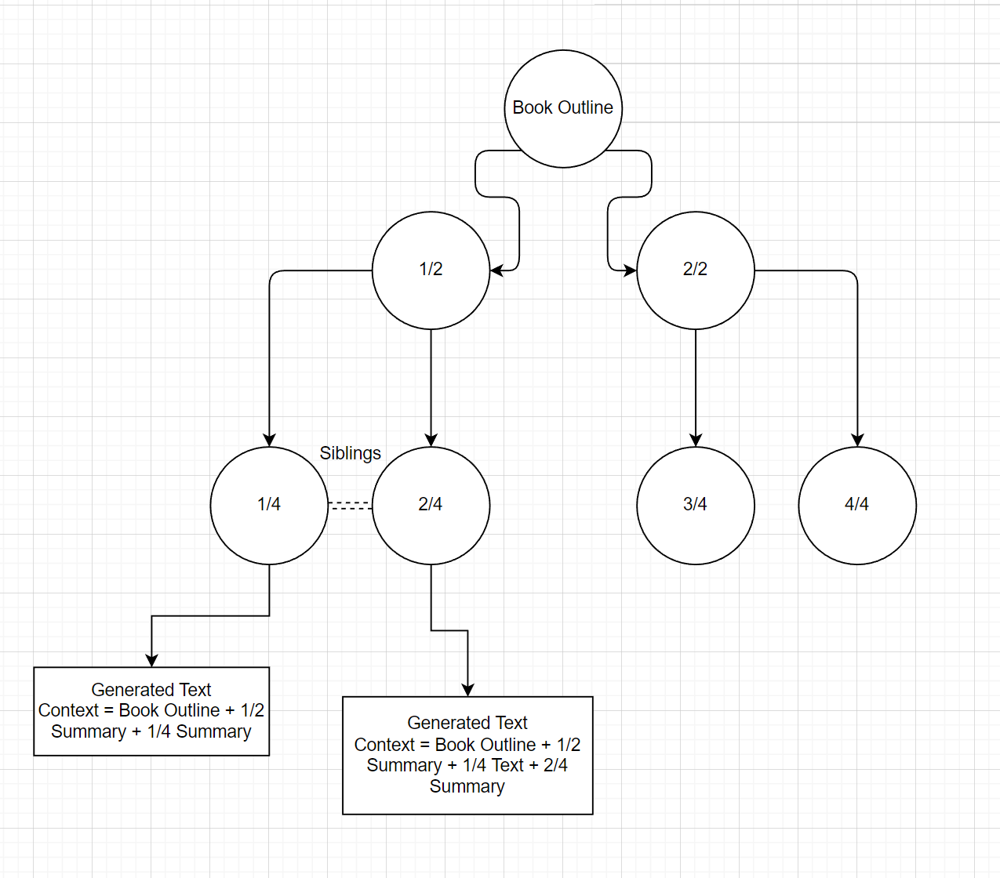

# Book Writer AI

This writes books using the OpenAI Chat API. Currently works for GPT3.5 and GPT4. This is a Windows Forms application, although the methodologies could be applied to any development environment. Feel free to explore.

Instructions - Getting started:

* Open in Visual Studio 2022.
* From the Nuget Package Manager install:
* DocX by Xceed. (for Word export)
* itext7 by iText Software. (for PDF export)
* Newtonsoft.Json

Usage Instructions:
* Run the BookWriterAI program
* Type in an Idea for your book, or press Generate in the Idea area at the top. This can be detailed, or non-detailed. Example: "A retired detective discovers a hidden portal to an alternate reality where unsolved crimes are the key to maintaining cosmic balance, forcing her to solve cold cases to prevent chaos in both worlds."
1. In the **Book Outline** section, press Generate.
2. In the **Acts** area, press Generate.
3. In the **Chapters** area, press Generate.
4. Choose a book style, Author style, and set the Starting chapter to 1.
5. Press **Generate Book**.

Note that this is still very much a work in progress, and it can fail or timeout at any step of the process. For this reason, after each step, after pressing "Generate", it's a good idea to choose 
"Save Book", which will export a .bk file which is a JSON representation of the book.

# How it works

As of now, the system works simply by generating a high level outline of the book, including an overall plot, and characters involved (Step 1). 

In step 2, it breaks down that into 6 acts. 

In step 3, it breaks down each act into several chapters.

Finally, in step 4, it generates the content for each chapter, by breaking it down into subchapters, and writing the prose for each subchapter. 

# Context

Context is maintained (still a work in progress), by feeding in the previous subchapter, as well as cast of characters, and several other pieces of data including what chapter it is, what act it is, and whether or not a character has been introduced or not. This is not a perfect system, and thus this is an open source project looking for collaborators to help make it better.

# Node-based idea...

There is also an unfinished system in place to instead use a node-based system that breaks things down into subtrees. This is, in theory, a more versatile system to be able to feed in context, and make longer books. So books are broken into n nodes, which are broken into n subnodes, which are broken into n subnodes, etc. The idea being that the context for any node can be provided by doing a traversal up the tree from that node. It's just a theory, again, so anyone is welcome to explore it further. The idea is that you should be able to use it to generate complex node-based structures for entire books with n-depth level of complexity. Here's an example image showing only 2 levels of depth.

In general, GPT-4 produces better sounding narratives.

Licensed under MIT license.
